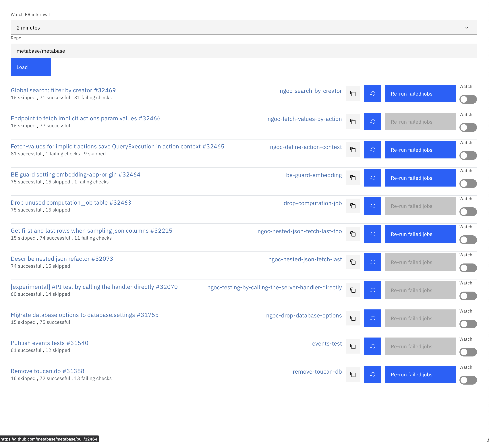

# PR Watcher
Are you tired of babysittings multiple PRs and the CI keeps flaking? I have a solution for you.
This is a dashboard that can help you:
- View all active PRs in a single view
- Re-run failed jobs
- Refresh the status of PRs

# How to use
- Download the single HTML file from the release page
- You'll need a Personal Access Token to use the app. You can generate one from [https://github.com/settings/tokens](https://github.com/settings/tokens)
